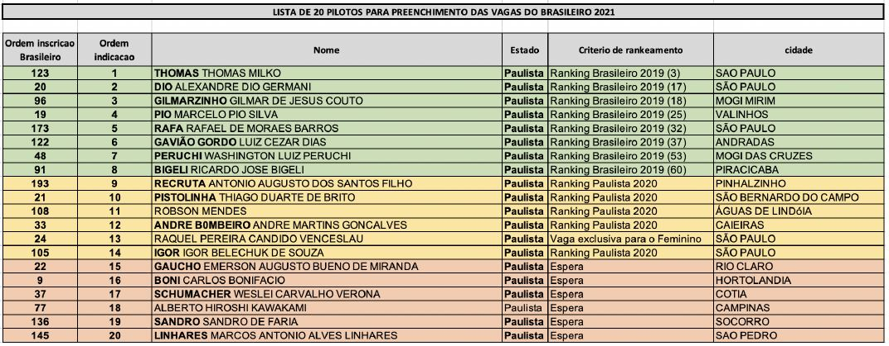
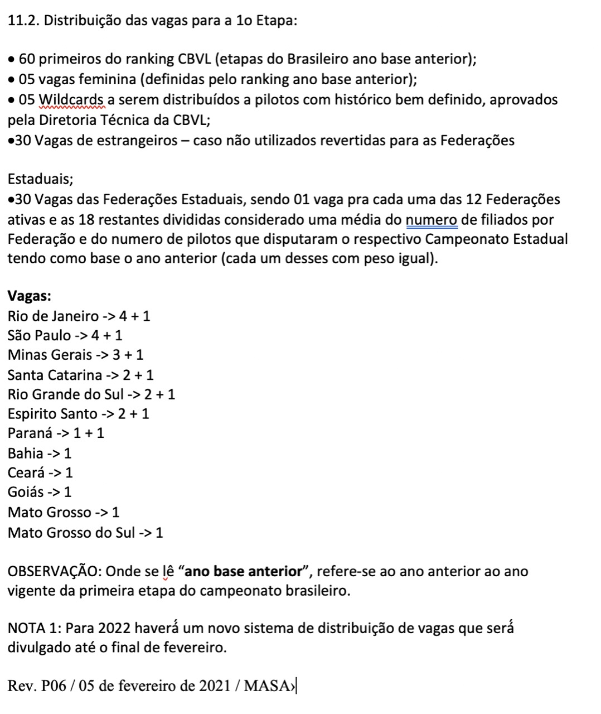

Em abril será realizada a primeira etapa do campeonato brasileiro em Governador Valadares - MG e as regras que definem os pilotos que podem participar segue abaixo:

🟩 Na Planilha os pilotos em verde são os que tem a vaga garantida para o Brasileiro de 2021, pois permaneceram entre os 60 pilotos do ranking do Brasileiro de 2019.

🟨 Em amarelo são os pilotos indicados para preencher as vagas pelo  
estado de SP, respeitando a classificação obtida no campeonato estadual em 2019, que no caso do estado de SP é o originado na etapa única do ano passado. o estado de SP tem direito a 4+1  vagas ou seja 5 pilotos.

🟥 E por ultimo vem em vermelho, os próximos pilotos a serem indicados de acordo com o ranking estadual e que se inscreveram para participar do Brasileiro de 2021. Os pilotos que foram chamados e não efetuaram a confirmação via pagamento ou as vagas de estrangeiros que não forem preenchidas, novas solicitações de pilotos serão requisitadas as federações estadual, ao que será indicado na sequencia os pilotos da divisão em vermelho.

