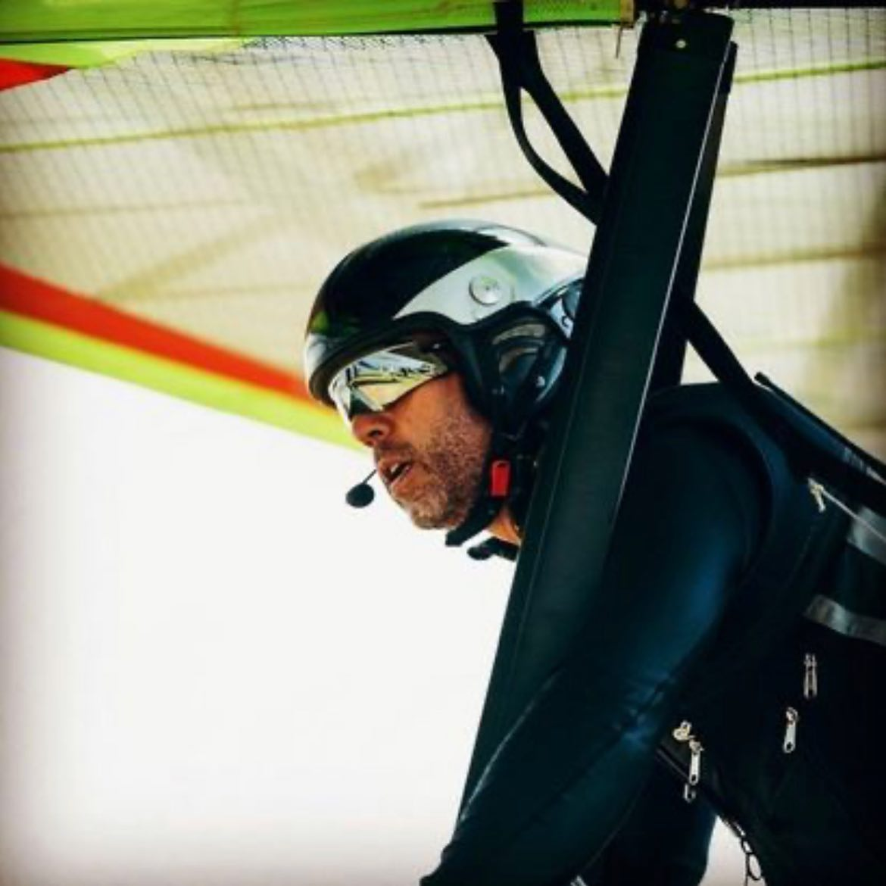

O paulista David Brito Filho, piloto federado a FPVL é o novo campeão brasileiro de Asa Delta!  

A FPVL parabeniza o piloto David Brito Filho pela excelente conquista.  

Confira o resultado e matéria oficial no site da CBVL:  

> David tem diversos títulos estaduais no currículo e há tempos almejava a conquista nacional. Como o Brasileiro 2021 aconteceria num único evento, ele adotou como estratégia ser agressivo no início e ponderado ao final. Deu certo.   
O paulista matou as duas primeiras provas, assumindo a ponta da classificação. Depois foi comedido, evitando erros e se mantendo sempre entre os dez primeiros - com exceção de um dia. Assim, chegou aos 3.715 pontos e garantiu o troféu.  
“Eu vim muito focado, se antes faltava um pouco de preparo mental agora eu estava disposto a não deixar passar a oportunidade. Consegui administrar bem o voo, a cabeça, a técnica. E a próxima meta já está definida: quero ser campeão Mundial por Equipes com o Brasil”.

https://www.cbvl.esp.br/noticias/brasileiro-de-asa-coroa-campeoes-ineditos/
